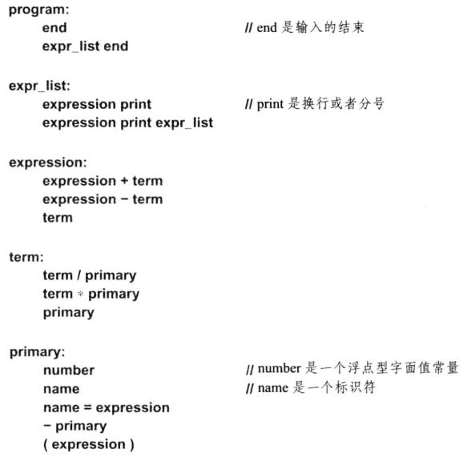

# A recursive descent evaluator

This is a evaluator for simple arithmetic expressions, which takes from "the c++ programming language" book. Its uses a recursive descent parser to parse the expressions.
The following figure shows its BNF syntax.

